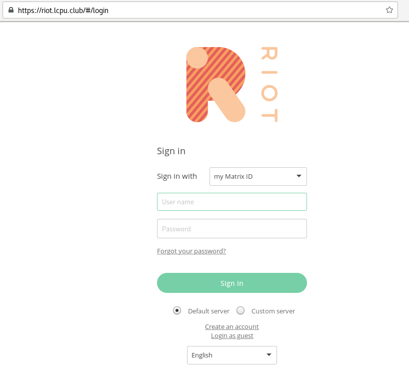
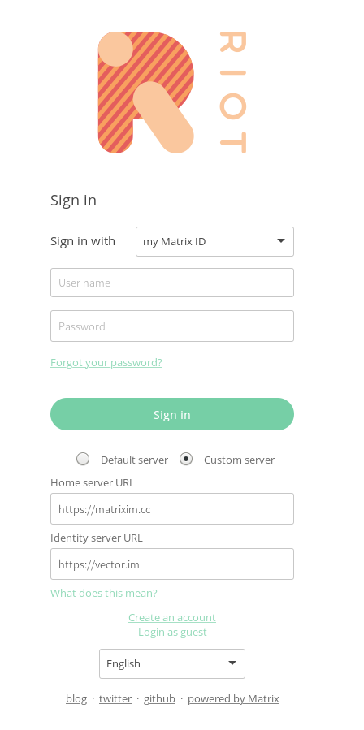
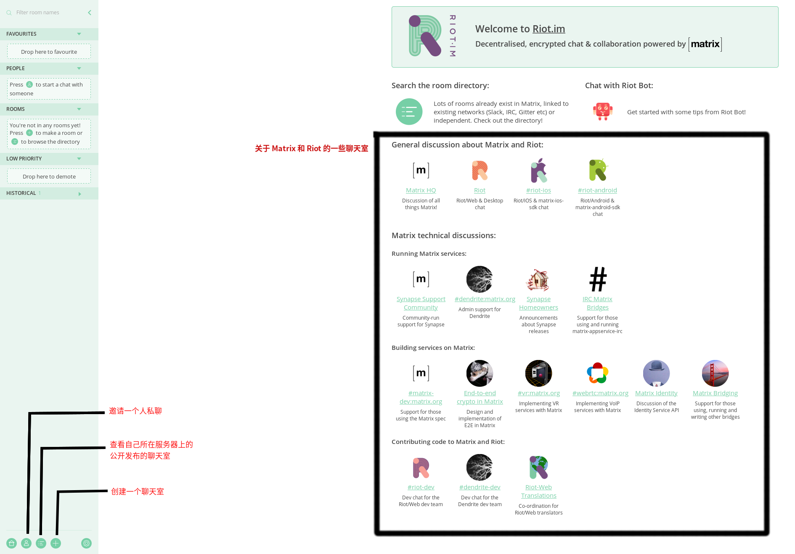

Matrix聊天快速指南
==================

可以参考我在2017年软件自由日上的演讲，比本文更加详细： https://matrixim.cc/sfd2017-matrix.pdf

矩阵一入深似海，从此[电幕](https://zh.wikipedia.org/wiki/%E7%94%B5%E5%B9%95)是路人。

为什么用Matrix?
---------------

Matrix是一个近些年来快速发展起来的去中心化的消息协议，通过服务器间的联合使不同服务器上的用户可以通信，同时用户的聊天记录存放在他们选择的服务器上。

我们应该选择什么聊天软件/协议？

- 客户端必须是[自由软件](https://fsfs-zh.readthedocs.io/zh/latest/free-sw/#_2)，确保该软件不容易做不正确的事，于是排除**微信、QQ、Skype、Discord**等软件，有报告称，某些私有聊天软件会配合政府监控用户：
    + [微信一app两制](https://citizenlab.org/2016/11/wechat-china-censorship-one-app-two-systems/)
    + [微软，棱镜门和NSA](https://www.theguardian.com/world/2013/jul/11/microsoft-nsa-collaboration-user-data)
- 服务端也需要是自由软件，从而不会因为集中在一个服务器而被封锁，于是排除**Telegram**
- 不同服务器间最好能互通，即使用联邦式(federation)聊天协议，在这点上，IRC和Rocket.Chat并不是好的选择，集中式的协议更适合部署在企业等部门内部使用
- 支持端到端加密，最好是协议自身支持

于是我们选择Matrix，它符合以上所有特征。在近几年，Matrix网络的流量也在高速上升（可见[此Matrix官方博文](https://matrix.org/blog/2017/07/07/a-call-to-arms-supporting-matrix/)）。同时，Matrix官方也提供到IRC的桥接服务，方便用户在Matrix中使用IRC聊天室。当然了，你也可以用[fishroom](https://github.com/tuna/fishroom)等工具进行桥接。

还有一些优秀的聊天协议：

- [XMPP](https://xmpp.org): 一个经典的通信协议，核心功能很小，扩展性很强。在安全方面，有XEP标准支持OTR端到端加密，支持多端加密的OMEMO也已经在一些客户端中启用。主要问题在于不同服务器和客户端的XEP实现程度不统一，一般不保存消息记录，多端同步不稳定。
- [Tox](https://tox.chat), [GNU Ring](https://ring.cx), bitmessage, ...: 基于DHT网络的P2P聊天协议

选择 Matrix 服务器
------------------

首先，Matrix是一个去中心化的网络，我们需要先选择一个服务器。和XMPP有<https://xmpp.net>一样，我们也可以先找找有哪些Matrix服务器。[Hello Matrix](https://www.hello-matrix.net/)为我们提供了一份[非官方Matrix服务器列表](https://www.hello-matrix.net/public_servers.php)。

如果你还在犹豫选择哪个服务器，你可以选择下面中的其中一个：

- matrix.org: Matrix项目的官方服务器，服务端维护和更新都很及时。服务器地址在英国。
- matrixim.cc: 我自己搭建的服务器，由我一个人维护。服务器在Lunanode的Toronto机房。可以直接从客户端注册，不需要填写Google reCAPTCHA.
- disroot.org: 从disroot官方网站的介绍看，他们是一个推进去中心化网络的组织。注册一个disroot帐号就可以同时得到一个E-Mail,XMPP,Matrix和[Diaspora\*](https://diasporafoundation.org/)帐号。不过之前disroot出过ldap配置错误导致任意密码登陆Matrix的事故:)

或者，你可以自己搭一个服务器！

使用 Riot
---------

当前功能最丰富的Matrix客户端是[Riot](https://riot.im)，它有网页版，Android版和iOS版，把网页版封装后安装到本地硬盘就变成了桌面版。以下介绍网页版。

网页版 Riot 由静态 HTML 页面和 JS 脚本组成，它可以放在本地使用，也可以把它放在 web 服务器上让用户访问。不少 Matrix 服务提供者都会提供一个 Riot web，其默认服务器是他们自己的服务器，例如 <https://riot.lcpu.club> 是我自己部署的 Riot，默认服务器是 <https://matrixim.cc>，而官方的 Riot 位于 <https://riot.im/app>，默认服务器是 <https://matrix.org>，而 <https://riot.im/develop> 是开发中的 Riot 不稳定版本，会提供一些在后续版本中出现的新功能。

以下我以 <https://riot.lcpu.club> 为例介绍 Riot 的用法。之后再简单地介绍 Android 版和 iOS 版的用法。

### 注册和登录

打开 Riot web 之后，我们可以看到下图所示的登录界面。如果你用的是 <https://riot.im/app> 等其他 Riot 实例，可能会以 guest 的身份登录，你可以点击左上方的 Login 或 Register 进行登录或注册。

注意 Sign in 按钮下方选择的是 Default server，因此，如果你用的是 <https://riot.lcpu.club>，则服务器已经是 <https://matrixim.cc>. 如果你需要换服务器，你可以选择 Custom server，效果如下。

> 注意，这里填 ``https://matrix.org`` 或者 ``https://matrixim.cc``，是因为Matrix使用HTTP作为客户端-服务端接口。
> 客户端访问服务器的方式是向服务器发送HTTP请求。一般来说，Matrix服务器都会打开HTTPS作为用户访问服务器上Matrix服务的方式。
> Identity server是用来管理第三方ID(如邮箱)和Matrix ID的关系的，推荐保持中心化的 ``https://vector.im`` 不变。

首先我们还是创建一个账户。点击下方的 Create a new account 即可，你只需要填写用户名和密码，再重复一次密码，之后点 Register 即可，不需要绑定邮箱或者手机号。

成功注册之后，Riot会自动用刚注册号的帐号登陆。如果你想在其他设备上登录，打开 Riot web 然后填写用户名和密码，点 Sign in 即可。

Android 版和 iOS 版的登录和注册界面类似，因此不再过多介绍。

### 开始聊天

登录后，可以看到 Riot web 的首页，为了方便，我在下图中标出常用的功能。

点击左下角的目录图标，可以看到你用的服务器中的公开聊天室列表。你也可以直接填写要加入的房间，如``#lcpu:matrixim.cc``，然后回车就能加入。

要和其他人私聊，可以点左下角的Start chat(图案是一个人)，填写你要联络的人的MXID.

你也可以点击图案是加号的按钮，创建一个房间，然后拉其他人进来。
